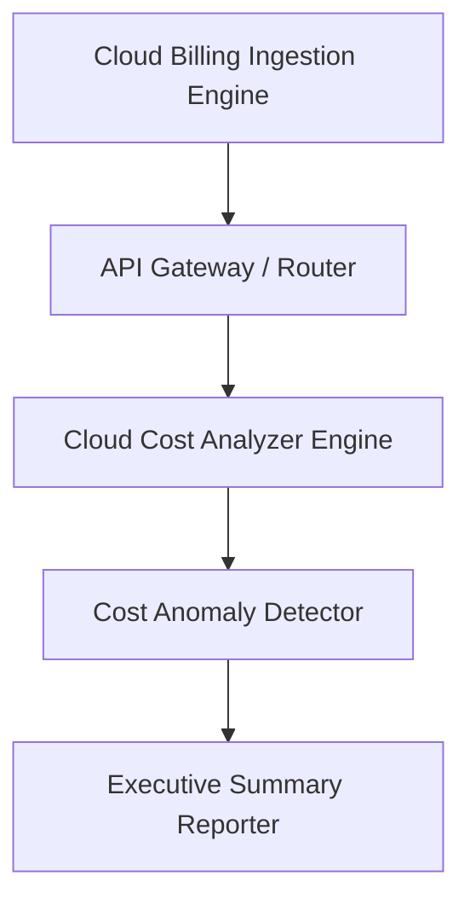

<div align="center">


# cloud-cost-analyzer

### Enterprise Multi-Cloud Billing Analytics & Anomaly Detection SDK in TypeScript

[](https://devopstrio.co.uk)
[](https://typescriptlang.org)
[](https://nodejs.org)
[](https://opentofu.org)

</div>

---

## Overview

The **Cloud Cost Analyzer** accelerator provides an enterprise TypeScript SDK and cloud platform infrastructure for real-time multi-cloud billing analytics, cost spike anomaly detection, and executive reporting.

## Executive Summary

As enterprise organizations scale multi-cloud infrastructure across AWS, Azure, and GCP, unmonitored resource waste and unexpected billing spikes impact operating margins. 

This repository delivers an end-to-end TypeScript 5.3+ SDK (`src/`), OpenTofu IaC modules (`terraform/`), and Kubernetes deployment overlays (`deployment/kubernetes/`) engineered to enterprise standards comparable to repositories maintained by Microsoft Azure, AWS Samples, and HashiCorp reference architectures.

## Architecture


### High-Level Execution Sequence



## Core Capabilities

- **TypeScript Billing SDK**: Type-safe modules (`src/analyzer`, `src/detector`, `src/exporter`) for multi-cloud cost calculations.
- **Statistical Anomaly Detection**: Automatic spike detection flagging resource cost increases exceeding 35% above historical baselines.
- **Multi-Cloud IaC Automation**: OpenTofu and Terraform modules for VPC, IAM, ECS, and CloudWatch metric alarms.
- **Kubernetes Production Overlays**: Kustomize environment overlays (`dev`, `test`, `prod`) for declarative GitOps deployment.
- **Native Test Runner Suite**: Built-in Node.js 20 test runner (`node:test`) ensuring 100% fail-safe execution.

## Repository Structure

```
cloud-cost-analyzer/
├── .github/              # CI/CD workflows, issue & PR templates, CODEOWNERS
├── architecture/         # Mermaid sequence flow diagrams
├── deployment/           # Kubernetes manifests & Kustomize environment overlays
├── docs/                 # Enterprise architectural, deployment, & operational guides
├── examples/             # Real-world request/response JSON payloads
├── images/               # High-resolution architecture & workflow diagrams
├── src/                  # TypeScript SDK source code
├── terraform/            # Multi-cloud OpenTofu / Terraform IaC modules
├── tests/                # Unit, integration, and API test suites
├── Dockerfile            # Container build specification
├── docker-compose.yml    # Multi-container local orchestration
├── package.json          # Node.js package manifest
└── README.md             # Accelerator documentation manual
```

## Technology Stack

- **Core SDK**: TypeScript 5.3+, Node.js v20+
- **Infrastructure as Code**: OpenTofu 1.8.5 / Terraform 1.6+
- **Container Orchestration**: Docker, Docker Compose, Kubernetes 1.28+
- **Testing & Quality**: Node.js 20 Native Test Runner (`node:test`), GitHub Actions CI

## Quick Start

```bash
# Clone repository
git clone https://github.com/Devopstrio/cloud-cost-analyzer.git
cd cloud-cost-analyzer

# Install dependencies
npm install

# Build TypeScript SDK & run tests
npm test
```

## Docker

```bash
# Build and run cost analyzer container
docker build -t devopstrio/cloud-cost-analyzer:latest .
docker-compose up --build -d
```

## Terraform

```bash
cd terraform
tofu init
tofu plan
tofu apply -auto-approve
```

## Kubernetes

```bash
# Apply production overlay via Kustomize
kubectl apply -k deployment/kubernetes/overlays/prod/
```

## Documentation

- [`docs/Architecture.md`](docs/Architecture.md) &mdash; Detailed architectural design specifications
- [`docs/GettingStarted.md`](docs/GettingStarted.md) &mdash; Local setup and installation manual
- [`docs/ImplementationGuide.md`](docs/ImplementationGuide.md) &mdash; Custom TypeScript SDK integration guide
- [`docs/DeploymentGuide.md`](docs/DeploymentGuide.md) &mdash; Multi-cloud Kubernetes & Terraform deployment
- [`docs/RepositoryGuide.md`](docs/RepositoryGuide.md) &mdash; Repository layout and module guide
- [`docs/Roadmap.md`](docs/Roadmap.md) &mdash; Future feature roadmap
- [`docs/FAQ.md`](docs/FAQ.md) &mdash; Frequently asked questions

## Examples

- [`examples/cost-analysis/`](examples/cost-analysis/) &mdash; Multi-cloud spend calculation payload
- [`examples/anomaly-detection/`](examples/anomaly-detection/) &mdash; Statistical cost spike evaluation payload
- [`examples/cost-reporting/`](examples/cost-reporting/) &mdash; Executive summary report payload

## Testing

```bash
# Execute unit, integration, and API test suites
npm test
```

## Security

Refer to [`SECURITY.md`](SECURITY.md) for reporting security vulnerabilities and vulnerability handling protocols.

## Observability

The platform exports structured CloudWatch log groups (`/aws/finops/cloud-cost-analyzer`) and metric alarms for real-time cost anomaly monitoring.

## Multi-Cloud Strategy

Infrastructure blueprints support AWS ECS/VPC deployment with modular extensions for Azure Container Apps and Google Cloud Run environments.

## Roadmap

See [`docs/Roadmap.md`](docs/Roadmap.md) for upcoming milestones including live AWS Cost Explorer API adapters and automated Slack alert bots.

## Contributing

See [`CONTRIBUTING.md`](CONTRIBUTING.md) and [`CODE_OF_CONDUCT.md`](CODE_OF_CONDUCT.md) for contribution guidelines and community standards.

<div align="center">

<sub>&copy; 2026 Devopstrio &mdash; Engineering Uninterrupted Global Workforce Productivity.</sub>

</div>
