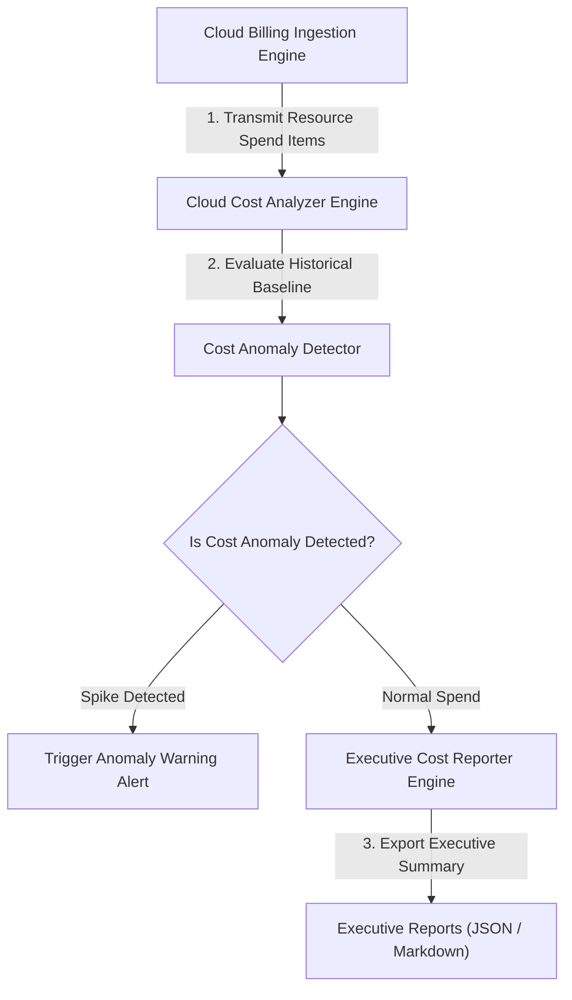

<div align="center">


# cloud-cost-analyzer

### Enterprise Multi-Cloud Billing Analytics & Anomaly Detection SDK in TypeScript

[](https://devopstrio.co.uk)
[](https://typescriptlang.org)
[](https://nodejs.org)

</div>

---

## ⚡ Technical Overview & SDK Scope

The **Cloud Cost Analyzer** is an enterprise billing analytics, waste identification, and cost anomaly detection SDK written in **TypeScript 5.3+ / Node.js v20+**.

It abstracts multi-cloud billing APIs across AWS, Azure, and GCP, allowing FinOps teams to detect cost spikes, quantify savings, and generate executive summaries.


---

## 🔄 Cost Analytics Sequence Flow



---

## 📂 Repository Directory Layout

```
cloud-cost-analyzer/
├── .github/
│   └── workflows/
│       └── analyzer-ci.yml      # Node.js 20 CI test pipeline
├── docs/
│   ├── ARCHITECTURE.md          # Architectural specification document
│   ├── deployment-guide.md      # Integration & SDK manual
│   └── images/
│       └── architecture_diagram.jpg # Visual blueprint diagram
├── src/
│   ├── index.ts                 # Main SDK export entrypoint
│   ├── analyzer/
│   │   └── cost_analyzer.ts     # Multi-cloud spend analyzer
│   ├── detector/
│   │   └── anomaly_detector.ts  # Billing spike anomaly detector
│   └── exporter/
│       └── cost_reporter.ts     # Executive summary reporter
├── tests/
│   ├── cost_analyzer.test.ts    # Cost analyzer unit tests
│   └── anomaly_detector.test.ts # Anomaly detector unit tests
├── package.json                 # Node.js package manifest
├── tsconfig.json                # TypeScript compiler config
├── .gitignore                   # Git ignore file
└── README.md                    # SDK documentation
```

---

## 🚀 Quick Start Guide

### 1. Installation

```bash
# Clone repository
git clone https://github.com/Devopstrio/cloud-cost-analyzer.git
cd cloud-cost-analyzer

# Install dependencies & build
npm install
npm run build
```

### 2. TypeScript SDK Usage

```typescript
import { CloudCostAnalyzer } from "cloud-cost-analyzer";

const analyzer = new CloudCostAnalyzer();
const res = analyzer.analyzeSpend([
  { resourceId: "i-0991", service: "EC2", provider: "AWS", monthlyCostUSD: 2500 }
]);

console.log("Total Spend:", res.totalSpendUSD);
```

### 3. Run Jest Unit Test Suite

```bash
npm test
```

<div align="center">

<sub>&copy; 2026 Devopstrio &mdash; Engineering Uninterrupted Global Workforce Productivity.</sub>

</div>
