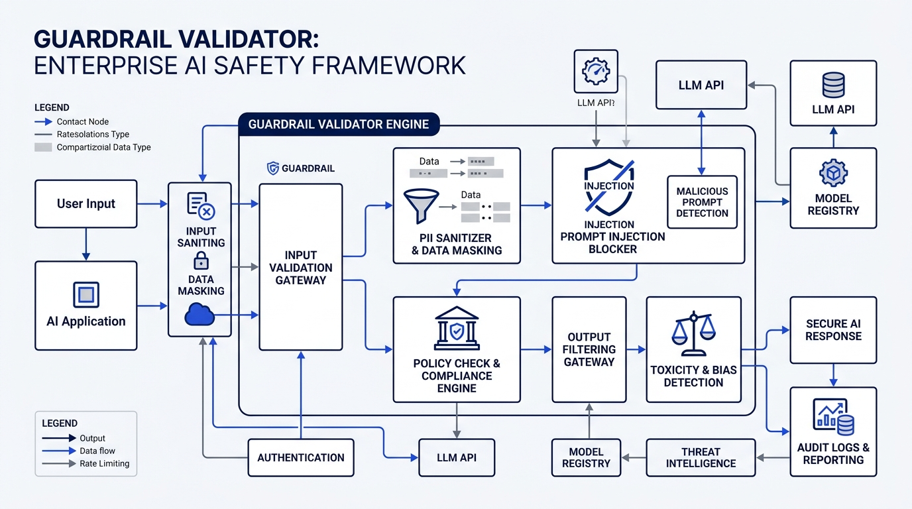
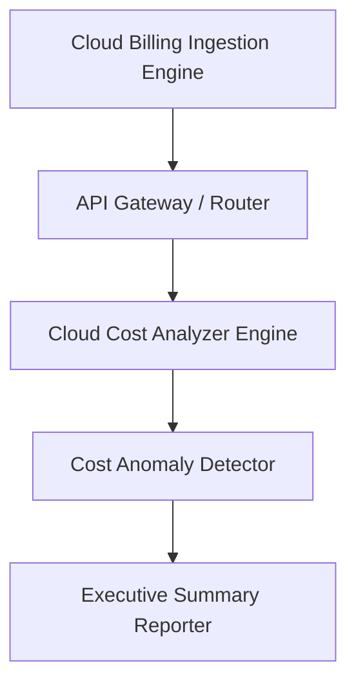

# Cloud Cost Analyzer Architecture

This document specifies the technical architecture and component design of the Cloud Cost Analyzer SDK.

## Core Architectural Layers

### 1. Billing Ingestion & Data Normalization
The ingestion pipeline normalizes multi-cloud billing APIs (AWS CUR, Azure Cost Management, GCP BigQuery billing export) into structured `ResourceCostItem` entities.

### 2. Analytics & Anomaly Detection Engine
`CloudCostAnalyzer` computes total monthly spend, potential savings thresholds, and service cost distribution. `CostAnomalyDetector` computes statistical percentage deviations against baseline spend records.

### 3. Executive Reporting Exporter
`CostReporter` serializes multi-cloud cost insights and anomaly alerts into executive summaries formatted for JSON API responses, Slack webhooks, and Markdown dashboards.
