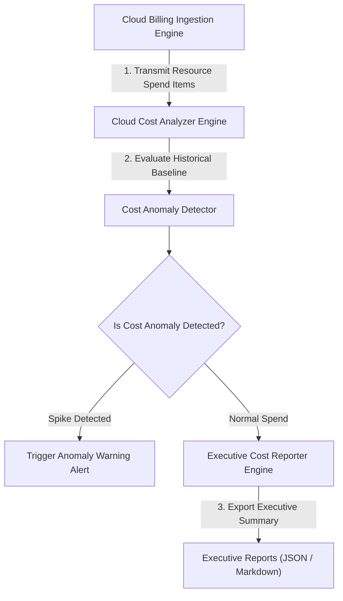

# Cloud Cost Analyzer Architecture

The **Cloud Cost Analyzer** is an enterprise billing analytics, waste identification, and cost anomaly detection SDK written in **TypeScript 5.3+ / Node.js v20+**.

## Component Sequence Diagram

## Core SDK Engine Modules

1. **Cloud Cost Analyzer (`src/analyzer/cost_analyzer.ts`)**
   - Calculates total cloud spend, identifies top cost services, and computes potential savings.

2. **Cost Anomaly Detector (`src/detector/anomaly_detector.ts`)**
   - Compares real-time resource billing items against historical spend baselines.

3. **Cost Reporter (`src/exporter/cost_reporter.ts`)**
   - Formats billing insights and anomaly warnings into executive summary reports.

4. **SDK Entrypoint (`src/index.ts`)**
   - Primary TypeScript export module.
